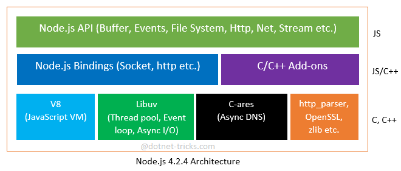
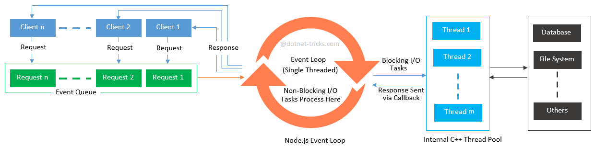

# Node-Js
# What is node js?
->node js is runtime environment and library for running JavaScript applications outside the browser.
->used to create server-side aplications
->it is open source and free to use
-> node js app runs in a single process without creating a new thread for every request.
-> many of the basic modules of node js are written in javascript.
-> it is built on chrome's javascript engine.

# what is  mean by client side scripting lanugage and server side scripting language?
 ->client side means that the action takes place on the user's computer. it runs code like javascript on desktop
 ->server side means that the action takes place on the web server.it can deliver dynamic content to web pages iin reponse to the client device.

 

# Node.js vs. other Server Side frameworks
Node.js is different from existing server-side frameworks because it is based on asynchronous events via JavaScript callback functionality and uses the JavaScript as a programming language. Moreover, everything inside Node.js runs in single thread.
While existing server-side framework like ASP.NET, JSP and Php etc. are based on multiple threads web server (IIS/Tomcat). In multiple threads system, there is a limit of maximum number of threads, beyond which the throughput decreases.

# Features of node js?
fast
i/o is asynchronous and event driven
single threaded
scalable
open source

# node js code execution process :

Clients send theirs request to Node.js Server.

Node.js Server receives those requests and places them into a processing Queue that is known as “Event Queue”.

Node.js uses JavaScript Event Loop to process each client request. This Event loop is an indefinite loop to receive requests and process them. Event Loop continuously checks for client’s requests placed in Event Queue. If requests are available, then it process them one by one.

If the client request does not require any blocking I/O operations, then it process everything, prepare the response and send it back to the client.

If the client request requires some blocking I/O operations like interacting with database, file system, external services then it uses C++ thread pool to process these operations.

Thread pool process steps are as:

Event loop checks for thread availability from internal thread pool. If thread is available, then picks up one thread and assign the client request to that thread.

Now, this thread is responsible for handling that request, process it, perform blocking I/O operations, prepare the response and send it back to the Event Loop.

Finally, the Event Loop sends the response to the respective client

# What is event loop
The event loop is a central component of Node.js that manages all the asynchronous operations. It constantly checks for new events in the event queue and processes them in a loop.
Event Queue: The event queue holds various types of events, such as callbacks, timers, and I/O events, that are generated as a result of asynchronous operations. These events are added to the queue when they are triggered but are not executed immediately.

Callbacks: Callbacks are functions that are provided as arguments to asynchronous functions. They are executed once the corresponding asynchronous operation is completed and the event loop reaches the event in the queue. This mechanism allows Node.js to perform tasks without waiting for the completion of one task before moving on to the next.

Timers: Node.js provides two types of timers: setTimeout() and setInterval(). These timers schedule callbacks to be executed after a specified amount of time or at regular intervals.

# What is a Module in JavaScript?
a module is a piece of reusable JavaScript code
Built-in modules
Local modules
Third-party modules
 ex: http
url
path
fs
os
You can use the built-in modules with the syntax below.

const someVariable = require('nameOfModule')

to import a module in js we use require().
we need to export the module to use it another file syntac:
module.exports={
    fun
}

# The Built-in HTTP Module?
 it allows node js to transfer data over the http.
 createServer() method is used to create an http server.
 Common use for the File System module:

Read files
Create files
Update files
Delete files
Rename files->
fs.appendFile()
fs.open()
fs.writeFile()

# File system in node js

->fs module enables interacting with the file systems
->it is a buit in module present inside the nodejs
->Every method in fs module has synchronous and asynchronous forms
->Asynchronous methods take a last parameter as completion function callback. Asynchronous method is preferred over synchronous method because it never blocks the program execution where as the synchronous method blocks.
->path module is used to handle and transform files path

# Http Methods
GET:we use when you want to get some data from the server
POST: used when you want to send and mutate some data in server
PUT:used to upload files data in server
PATCH:used to update the data
DELETE:used to delete the data

# Express FrameWork?
npm i express
 Express.js is a web framework for Node.js
 it helps manage a server and routes.
 example:
 const http=require('http')
const express=require('express')

const app=express();

app.get('/',(req,res)=>{
    return res.end("Hello From home page");
});
app.get("/about",(req,res)=>{
    return res.end("Hello from about")
})
const server=http.createServer(app);
server.listen(9000,()=>{
    console.log('server started')
})
the express framework will have inbuilt http module so no need to use http createserver when we use express
body-parser: This is a node.js middleware for handling JSON, Raw, Text and URL encoded form data.

# Express Request Object:
this will represents the http request and has properties for the request query string,params,body,http headers
properties:-
req.app
req.baseurl
req.body
req.params
req.path
req.query
# Express Response Object:-
this will specifies the http response which is sent by an express app when it gets an http request
it sends response back to the client browser.
res.send()
res.status()2
# Routing in express:
 it refers to determining how an application responds to a client request to a particular endpoint which is a url and a specific http request method.

 

